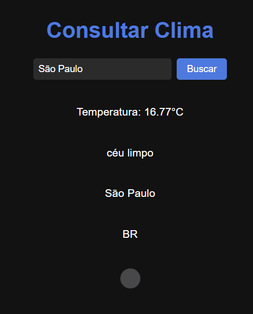

# 🌦️ Clima Agora

Aplicação web simples que permite ao usuário consultar a previsão atual do tempo em qualquer cidade do mundo, utilizando a API da OpenWeatherMap.

---

## 📸 Demonstração



> 💡 Substitua o caminho acima pelo caminho ou link da imagem/GIF da sua aplicação em funcionamento.

---

## 🎯 Objetivo do Projeto

Este projeto foi criado com o objetivo de praticar:

- Consumo de APIs externas via `fetch`;
- Manipulação de dados JSON no JavaScript;
- Interação com elementos do DOM;
- Exibição dinâmica de informações em tela.

---

## 🛠️ Tecnologias Utilizadas

- HTML5 _(com auxílio do ChatGPT)_
- CSS3 _(com auxílio do ChatGPT)_
- JavaScript (Vanilla JS)
- API: [OpenWeatherMap](https://openweathermap.org/)

---

## 🚀 Como Executar o Projeto

1. Clone ou baixe os arquivos do projeto.
2. Substitua a variável `chaveAPI` no arquivo `clima.js` pela sua própria chave da OpenWeatherMap (pode ser criada gratuitamente).
   ```js
   const chaveAPI = "SUA_CHAVE_AQUI";
   ```
3. Abra o arquivo `index.html` (ou `clima.html`, dependendo do nome que usou) em qualquer navegador moderno.

## 🔍 Explicação Técnica

### 🔧 HTML

A estrutura básica contém:

- Um campo de entrada (`input`) para digitar o nome da cidade;

- Um botão para buscar os dados;

- Uma `div` onde os resultados são exibidos dinamicamente.

### 🎨 CSS

Estilo clean e escuro com foco em legibilidade:

- Centralização do conteúdo;

- Botões com hover e bordas arredondadas;

- Layout responsivo simples.

### 📦 JavaScript

O JS faz todo o trabalho de:

- Capturar a entrada do usuário;

- Fazer uma requisição HTTP para a API do OpenWeatherMap;

- Tratar os dados de resposta (JSON);

- Exibir: temperatura, descrição do clima, cidade, país e um ícone representativo;

- Tratar erros (ex: campo vazio ou cidade não encontrada).

## 🧠 Aprendizados

Neste projeto, aprendi e pratiquei:

- Como consumir APIs usando `fetch`;

- Manipulação de objetos JSON vindos de uma API;

- Atualização dinâmica de conteúdo HTML via JS;

- Boas práticas de organização entre HTML, CSS e JS.

## 🤝 Créditos e Observações

- A estrutura HTML e o estilo CSS foram criados com o apoio do **ChatGPT**, enquanto a lógica em **JavaScript** foi desenvolvida por mim.

- A API utilizada foi a [OpenWeatherMap](https://openweathermap.org/), com suporte à linguagem e unidades personalizadas.

## 📁 Estrutura de Arquivos

📁 clima-agora/
├── clima.html
├── clima.css
├── clima.js
└── img/
└── clima.png

## 📬 Contato

**Mateus Santos**  
[LinkedIn](https://www.linkedin.com/in/mateus-sanjo/) | [GitHub](https://github.com/araujosantos20) | [Email](mailto:mateus.sanjo20@gmail.com)
